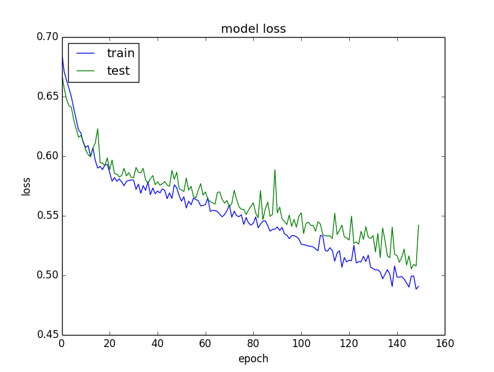

## ML for Document Scanning
### Optimization and deployment

##### _by Marek Linka_

---

### Previously on this session...

* The problem statement
* The issues with traditional solutions
* The problems with data
* A working model

----

### Previously... the problem

_Given a photo of a vehicle registration certificate, I want to know the coordinates of a bounding box containing the whole matriculation number and nothing else_

----

### Previously... the problem

----

### Previously... the model

* Input: 1200x847 resolution RGB images
* Only worked on 0/180 degree rotation
* Had 8 layers, 15m parameters
* Was trained on 500 examples generated from a single source
* Training took ~20 minutes
* Generalized reasonably well to new data

----

### Previously... The issues

* Non-square input images
* Only one true example for data augmentation
* Size (160 MB on disk)
* Small batch size, no regularization

---

## Moving forward

----

### Iteration workflow

* In  ML, quick iteration is key
* Don't focus on technicalities right off the bat
* Create a PoC for a subset of the problem, then expand it

----

### Problem 1 - Large input array

* Inputting a 1200x847 image is problematic
    * Not-square - cannot detect rotations of 90/270 degrees
    * It's just too much data
    * High resolution preserves lot of useless information
    * You need more convolutions to go through the data
    * Slows down learning

----

### Solution 1 - Smaller input

* Input changed to 800x800 images
    * Can deal with all rotations
    * Less data to process
    * Faster learning
* However, this still preserves more information than necessary

----

### Solution 1 - Even smaller input

* Input resized to 400x400 images
    * Very small size
    * Allows for larger batch size
    * Faster training
* Additionally, use grayscale inputs
    * Further reduces noise in the data

----

### Problem 2 - Single training example

* Generating training data from a single example is basically useless
    * It allows the network to learn specific content
    * This prevents generalization to real data
    * Applying random noise can help, but the impact is limited

----

### Solution 2 - More real examples

* Having ~30 real-world examples gives better generalization
    * Content is more random
    * You need more training examples to cover all bases
    * Applying random noise at generation improves generalization further
        * But even more training data is required

----

### Problem 3 - No generalization

* Sometimes the network fails to generalize properly
* Sometimes validation set performance fluctuates, sometimes it plateaus

----

### Problem 3 - Desired state

----

### Solution 3 - Regularization

* Batch normalization increases the numerical stability of activations
    * Shift+scale by batch mean and SD
    * Minimizes the churn of activations between layers/batches
* Other forms of regularization might also work (dropout, L2 regularization)

----

### Problem 4 - Network size

* Starting with a large network leads to problems
    * Insane amount of data
    * Slow learning, slow iteration
    * Overfitting (no generalization)

----

### Problem 4 - Network size example

* 52 milion parameters
* 1600 examples
* 100 training epochs
* Training time: 5 hours
* Resulting model size: 600 MB
* Very bad performance on new data

----

### Solution 4 - New architecture

* It's better to start from a small network
* First train to overfit, then deal with the overfitting
    * Overfitting means your network is large enough to learn the sought-after function
    * If you start from a small network, you will have the smallest possible network able to learn this function
* Train for a large number of epochs

----

### Solution 4 - Keras trickery

* Keras has several capabilities that can help in evaluating your network:
    * Validation while training
    * Model checkpointing

----

### Solution 4 - Results

* Parameter count: 52m vs 0.1m
* Training examples: 1600 vs 2400
* Epoch time: 100s vs 20s
* Model size: 600MB vs 1.2MB
* Validation loss: 4 (0.5%) vs 2 (0.5%)
* Prediction time: 15ms (650ms on CPU) vs 7ms (20ms on CPU)

---

### Bringing it to production

----

### From a model to a service

* Our model is small
* It's accuracy is satisfactory
* It performs well on both CPU and GPU
* However, it's still just a file on a PC
    * And some python code

----

### Operationalization - Options

* There are several options on how to pack and deploy the model
    * Use Flask to create a python web service
    * Use docker
    * Create the service in a language with python bindings
    * "THE CLOUD"

----

### Operationalization - Azure

* We can build the service using Flask and deploy to a VM
* We can use Azure App Service
* We can use Docker and deploy to a Kubernetes cluster
* Azure Machine Learning Workbench

----

### AMLW

* A new (preview) service for operationalizing ML models
    * Takes a model (even pre-trained)
    * Constructs a Docker image
    * Deploys the image to Azure Container Registry
    * Allows us to test locally
    * Allows us to deploy to Kubernetes easily